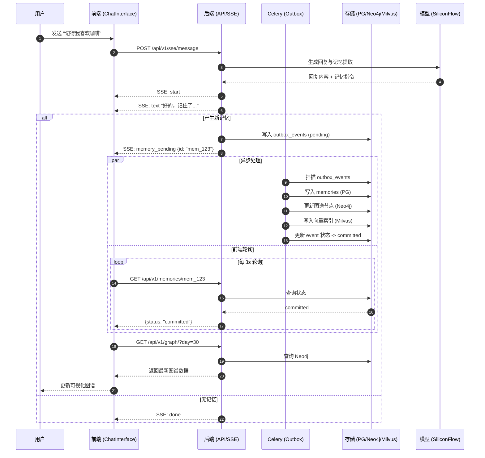
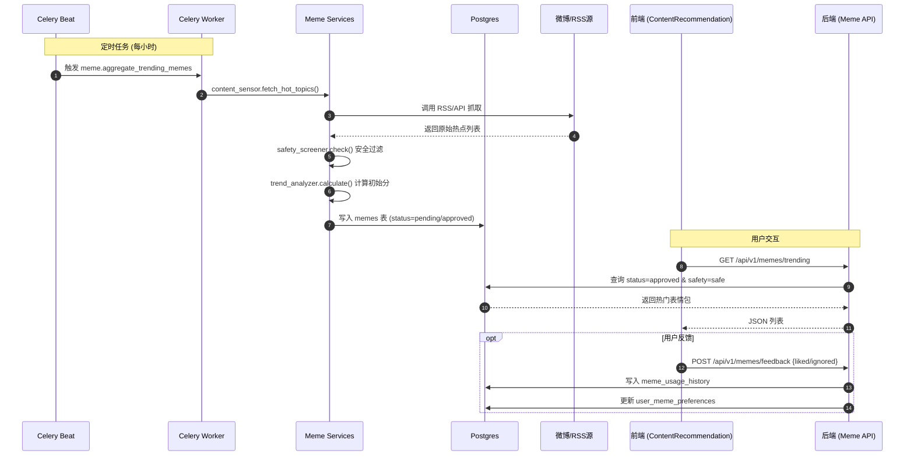
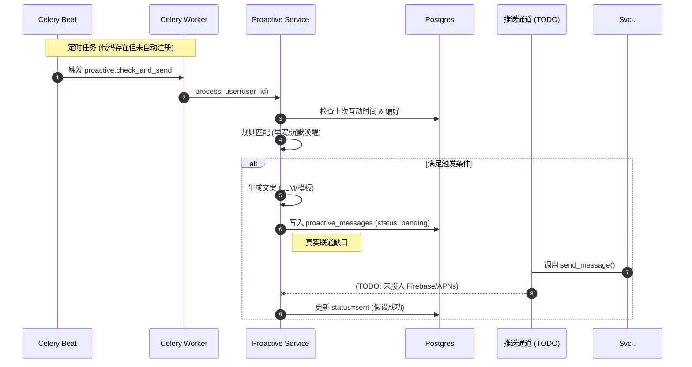

# 项目架构与全链路时序图

本文档基于代码库现状（截止 2026-01-19），真实反映系统的模块联通、依赖关系与数据流向，并标注了尚未完全真实接入的 MVP/Mock 点。

## 1. 系统总体架构图

展示前端、后端服务、任务调度、数据存储与外部依赖的真实拓扑。

```mermaid
graph TD
  subgraph Client [客户端层]
    Browser[Browser / React UI]
  end

  subgraph Frontend [前端服务 (Vite :5173/5174)]
    F1[App.tsx<br/>图谱/亲密度可视化]
    F2[ChatInterface<br/>SSE 对话流]
    F3[ContentRecommendation<br/>偏好设置与反馈]
    F4[api.ts<br/>Mock=False<br/>Proxy /api -> :8000]
  end

  subgraph Backend [后端服务 (FastAPI :8000)]
    B_Auth[/auth/token<br/>JWT 鉴权]
    B_SSE[/sse/message<br/>流式对话接口]
    B_Graph[/graph/?day<br/>记忆图谱]
    B_Affinity[/affinity/history<br/>亲密度历史]
    B_Meme[/memes/*<br/>热点/偏好/反馈]
    
    S_Conv[Conversation Service<br/>对话管理]
    S_Affinity[Affinity Service<br/>亲密度与健康边界]
    S_Retrieval[Retrieval Service<br/>RAG与LLM调用]
    S_Proactive[Proactive Service<br/>主动消息(TODO推送)]
    S_Meme[Meme Services<br/>抓取/筛选/趋势]
  end

  subgraph Worker [异步任务 (Celery Worker/Beat)]
    T_Outbox[outbox.*<br/>30s: 记忆与事件处理]
    T_MemeAgg[meme.aggregate<br/>1h: 微博热点抓取]
    T_MemeScore[meme.score<br/>2h: 趋势打分]
    T_Content[content.fetch<br/>每日: 内容聚合]
    T_Proactive[proactive.*<br/>(代码存在/未注册调度)]
  end

  subgraph Data [数据存储]
    DB_PG[(Postgres<br/>业务数据/Outbox)]
    DB_Redis[(Redis<br/>Celery Broker/Cache)]
    DB_Neo4j[(Neo4j<br/>知识图谱)]
    DB_Milvus[(Milvus<br/>向量检索)]
  end

  subgraph External [外部依赖]
    E_LLM[SiliconFlow/OpenAI<br/>DeepSeek-V3]
    E_Weibo[Weibo/RSS<br/>(API Key 需配置)]
    E_Push[Push Service<br/>(TODO: Firebase/APNs)]
  end

  %% 连接关系
  Browser --> F1
  Browser --> F2
  Browser --> F3
  F1 & F2 & F3 --> F4
  F4 -->|HTTP/SSE| Backend

  B_Auth & B_SSE --> S_Conv
  B_Graph & B_Affinity --> S_Affinity
  B_Meme --> S_Meme

  S_Conv --> S_Retrieval
  S_Conv --> S_Affinity
  S_Conv --> DB_PG
  
  S_Retrieval --> DB_Milvus
  S_Retrieval --> E_LLM

  S_Proactive -.-> E_Push
  S_Proactive --> DB_PG

  S_Meme --> E_Weibo
  S_Meme --> DB_PG

  Worker --> DB_PG
  Worker --> DB_Redis
  Worker --> DB_Neo4j
  Worker --> DB_Milvus

  T_Outbox --> S_Conv
  T_MemeAgg & T_MemeScore --> S_Meme
```

---

## 2. 核心业务时序图

### 2.1 对话交互与记忆生成 (SSE + Outbox)
真实反映前端 SSE 接收、后端慢路径记忆生成与前端轮询刷新的全流程。



### 2.2 表情包热点抓取与消费
展示后台定时抓取、筛选与前端消费的真实链路。**注意：需提供真实 WEIBO_API_KEY 才能产生数据。**



### 2.3 主动消息发送 (当前现状)
展示已实现的逻辑与未接通的推送渠道。



## 3. 关键配置说明

| 模块 | 真实性状态 | 关键配置项 | 说明 |
| :--- | :--- | :--- | :--- |
| **前端 API** | ✅ 真实 | `USE_MOCK_DATA=false` | 直连后端 8000 端口 |
| **LLM 服务** | ✅ 真实 | `OPENAI_API_KEY` | 需配置真实 Key (硅基流动) |
| **数据库** | ✅ 真实 | `PG/Redis/Neo4j/Milvus` | 依赖 Docker 服务运行 |
| **表情包** | ⚠️ 半真实 | `WEIBO_API_KEY` | 代码逻辑完整，需 Key 才有数据 |
| **主动消息** | ⚠️ 部分 | `DeliveryManager` | 逻辑完整，缺推送渠道与任务注册 |
